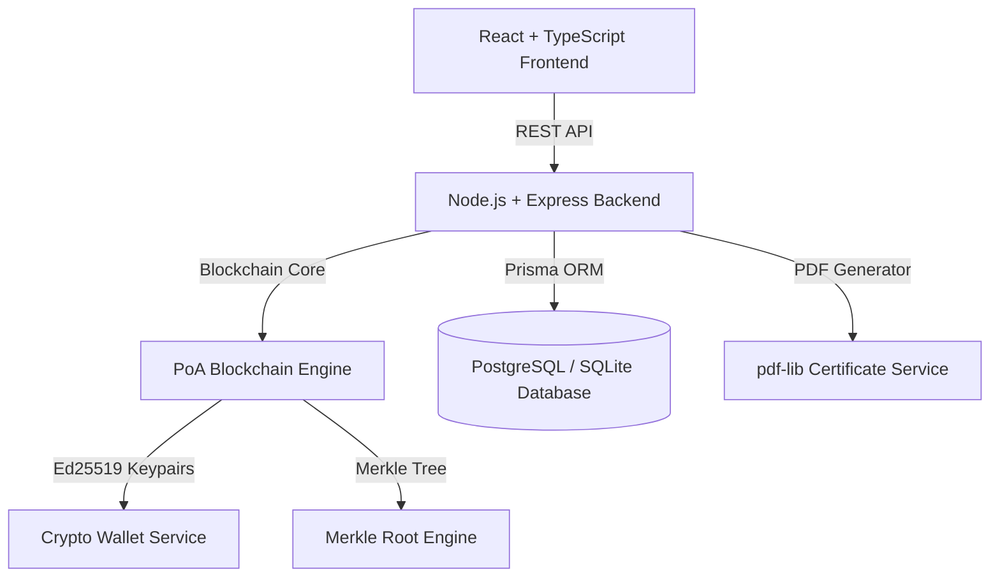

# CERTICHAIN

### *"Trust Every Credential."*


> A production-style, portfolio-quality **Blockchain-Based Certificate Issuance & Verification Platform** featuring a custom Proof-of-Authority (PoA) blockchain engine, SHA-256 document byte hashing, Ed25519 digital signatures, Merkle tree proofs, public verifier, institution dashboard, student credential wallet, and interactive Tamper Detection Security Lab.

---

## 🌟 Key Features

- **Custom Institutional Blockchain Engine (TypeScript)**: Proof of Authority (PoA) consensus model, SHA-256 block linking, Ed25519 digital signature signing & verification, and Merkle tree root calculation.
- **Public Verification Portal (`/verify`, `/verify/:id`)**: Instant sub-100ms cryptographic verification via Certificate ID, PDF file upload (Web Crypto API SHA-256 hashing), or QR code scanning.
- **Tamper Detection Security Lab (`/security-lab`)**: Educational laboratory allowing real-time modification of student data to showcase SHA-256 hash divergence (`❌ HASH MISMATCH`).
- **Interactive Merkle Tree Visualizer (`/merkle-tree`)**: Clickable path inspector tracing leaf transactions through intermediate hashes to the block Merkle Root.
- **3-Minute Interview Presentation Demo (`/demo`)**: 1-click guided walkthrough designed for live technical portfolio presentations.
- **Institution Dashboard (`/dashboard/institution`)**: Issue digital credentials, generate PDF certificates with embedded QR codes, view node analytics, and anchor immutable revocation transactions.
- **Student Holder Wallet (`/dashboard/student`)**: View credential wallet, download official PDFs, copy verification links, and view QR codes.

---

## 🏗️ Architecture



---

## 🛠️ Technology Stack

- **Frontend**: React 18, TypeScript, Vite, Tailwind CSS, Framer Motion, Lucide Icons, Recharts, Canvas Confetti, QRCode SVG
- **Backend**: Node.js, Express, TypeScript, Prisma ORM, JWT, bcryptjs, pdf-lib, QRCode, Multer
- **Blockchain**: SHA-256 Hashing, Merkle Trees, Ed25519 Signatures, PoA Consensus
- **Database & Testing**: PostgreSQL, SQLite, Vitest, Supertest
- **DevOps & CI/CD**: Docker, Docker Compose, GitHub Actions CI

---

## 🚀 Quick Start (Local Setup)

### 1. Prerequisites
- Node.js v18+ & npm v9+

### 2. Installation

```bash
# Clone the repository
git clone https://github.com/rajputnipun15/certichain.git
cd certichain

# Install dependencies for server and client
npm install --prefix server
npm install --prefix client

# Setup database & seed sample data
npm run prisma:setup --prefix server
```

### 3. Run Development Servers

```bash
# Run backend API server (Port 5000)
npm run dev:server

# Run frontend React app (Port 3000)
npm run dev:client
```

Open `http://localhost:3000` in your browser.

---

## 🐳 Docker Setup

Run the full stack app (Node backend + React frontend + PostgreSQL) with a single command:

```bash
docker compose up -d --build
```

Access the application at `http://localhost:5000`.

---

## 🧪 Testing

Run unit and REST API integration tests:

```bash
# Run Vitest test suite
npm test --prefix server
```

```
✓ tests/blockchain.test.ts  (6 tests)
✓ tests/api.test.ts         (6 tests)
Test Files  2 passed (2)
     Tests  12 passed (12)
```

---

## 📄 Documentation Sitemap

- [Architecture Guide](docs/ARCHITECTURE.md)
- [Blockchain Protocol Spec](docs/BLOCKCHAIN.md)
- [Certificate Lifecycle Flow](docs/CERTIFICATE_FLOW.md)
- [Security Model](docs/SECURITY.md)
- [API Reference](docs/API.md)
- [Production Deployment Guide](docs/DEPLOYMENT.md)
---

## 🔑 Demo Login Credentials

- **Institution Admin**: `admin@university.edu` / `password123`
- **Student**: `student@example.com` / `password123`
- **Sample Certificates**: `CERT-2026-000001` (Valid), `CERT-2026-000002` (Valid), `CERT-2026-000003` (Revoked)

---

## 📜 License

MIT License. See [LICENSE](LICENSE) for details.
