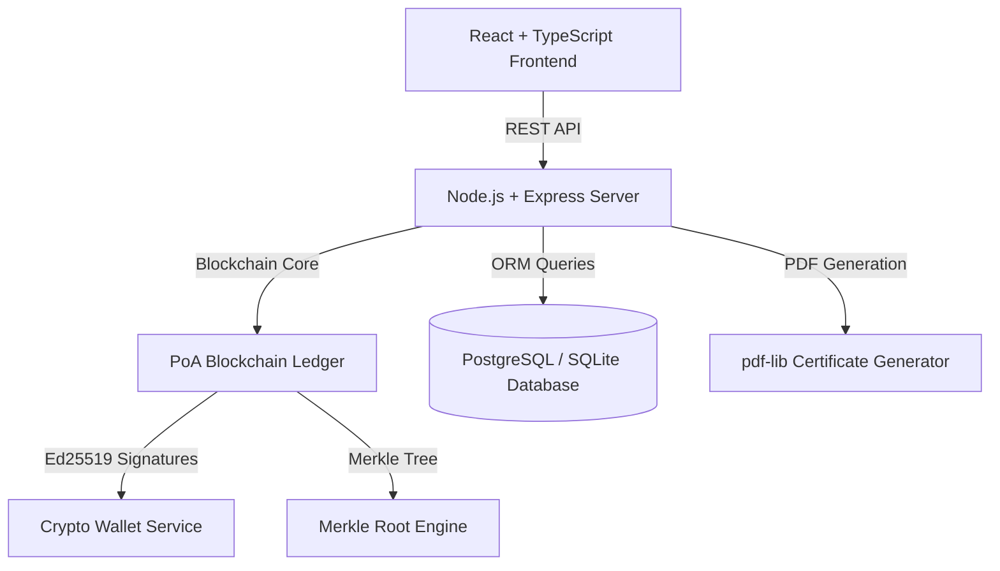

# CertiChain System Architecture

CertiChain is a high-assurance **Blockchain-Based Certificate Issuance & Verification Platform** designed for institutions, students, and employers.

## High-Level Architecture Diagram

## Core Architectural Components

1. **Client Layer (React 18 + Vite + Tailwind CSS)**
   - Dark mode glassmorphism UI system ("Midnight Indigo").
   - Web Crypto API for client-side SHA-256 PDF byte hashing prior to backend submission.
   - Interactive Merkle Tree visualizer & Tamper Detection Laboratory.

2. **Server Layer (Express + TypeScript)**
   - RESTful API endpoints for Auth, Certificate Issuance, Revocation, and Verification.
   - PDF Certificate Generator embedding QR codes pointing to `/verify/:certificateId`.

3. **Custom Proof-of-Authority (PoA) Blockchain Ledger**
   - SHA-256 block hashing and block header linking (`previousHash`).
   - Ed25519 digital signature signing by verified institution validator nodes.
   - Merkle Tree computation aggregating certificate transactions and generating inclusion proof paths.

4. **Persistence Layer (Prisma ORM)**
   - Dual compatibility with SQLite (out-of-the-box local testing) and PostgreSQL (production).
   - Syncs in-memory blockchain state with persistent DB records.
