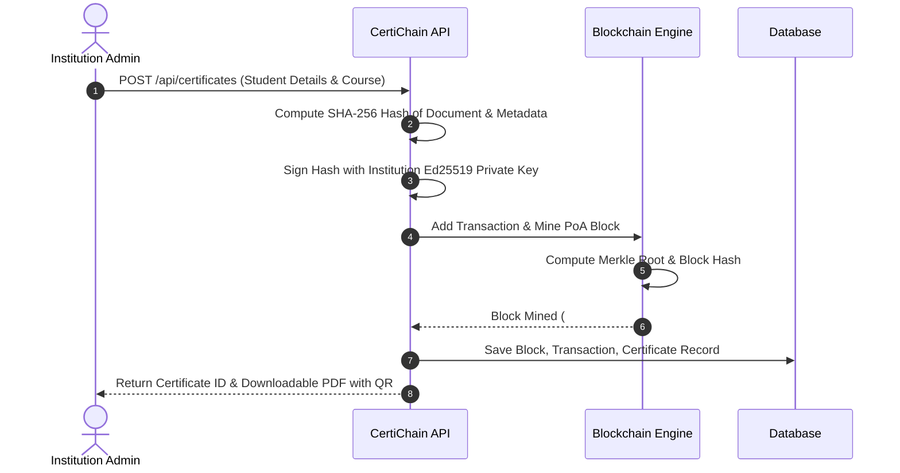
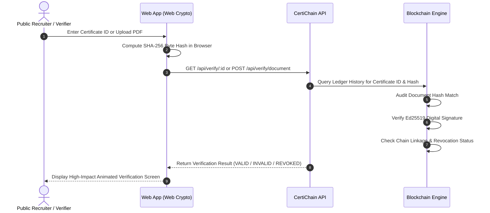

# Certificate Issuance & Verification Lifecycle

## 1. Issuance Flow

```mermaid
sequenceDiagram
    autonumber
    actor Admin as Institution Admin
    participant Server as CertiChain API
    participant Engine as Blockchain Engine
    participant DB as Database

    Admin->>Server: POST /api/certificates (Student Details & Course)
    Server->>Server: Compute SHA-256 Hash of Document & Metadata
    Server->>Server: Sign Hash with Institution Ed25519 Private Key
    Server->>Engine: Add Transaction & Mine PoA Block
    Engine->>Engine: Compute Merkle Root & Block Hash
    Engine-->>Server: Block Mined (#Index)
    Server->>DB: Save Block, Transaction, Certificate Record
    Server-->>Admin: Return Certificate ID & Downloadable PDF with QR
```

## 2. Verification Flow

```mermaid
sequenceDiagram
    autonumber
    actor Verifier as Public Recruiter / Verifier
    participant Client as Web App (Web Crypto)
    participant Server as CertiChain API
    participant Engine as Blockchain Engine

    Verifier->>Client: Enter Certificate ID or Upload PDF
    Client->>Client: Compute SHA-256 Byte Hash in Browser
    Client->>Server: GET /api/verify/:id or POST /api/verify/document
    Server->>Engine: Query Ledger History for Certificate ID & Hash
    Engine->>Engine: Audit Document Hash Match
    Engine->>Engine: Verify Ed25519 Digital Signature
    Engine->>Engine: Check Chain Linkage & Revocation Status
    Server-->>Client: Return Verification Result (VALID / INVALID / REVOKED)
    Client-->>Verifier: Display High-Impact Animated Verification Screen
```
